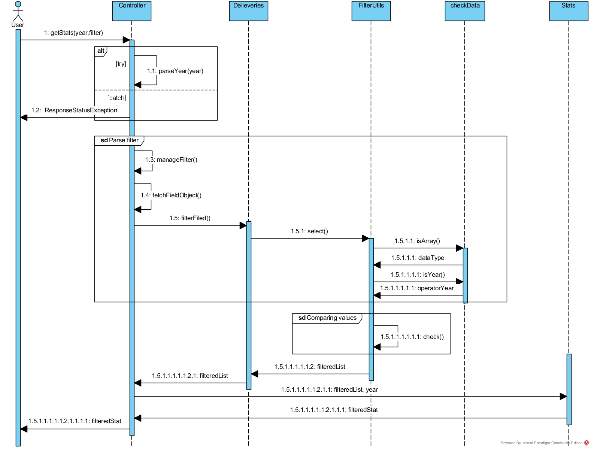

# ProgettoOOP

Il seguente file README.md andrà a spiegare le funzionalità dell'applicazione creata.
In particolare essa è un'applicazione REST, progettata in Java e con l'aiuto di Spring-Boot Framework, la quale, preso in ingresso un *URL* su cui si trovano dati in formato *JSON*, scarica un file (se non già presente) contente un dataset in formato CSV. Su questo file sarà possibile effettuare operazioni di filtraggio per ottenere i dati richiesti in formato *JSON.

## Il dataset
Il dataset CSV (scaricabile da [questo JSON](http://data.europa.eu/euodp/data/api/3/action/package_show?id=TXJLP91qYJyBYbBF4uug)) è un insieme di dati EUROSTAT riguardanti statistiche sulle percentuali di lettere consegnate in tempo (in base al tipo di spedizione) e suddivise per i vari paesi europei (maggiori dettagli sulle modalità dell'indagine sono reperibili qui: [glossario e note tecniche, PDF](https://publications.europa.eu/portal2012-portlet/html/downloadHandler.jsp?identifier=397a7a23-6d05-11e5-9317-01aa75ed71a1&format=pdf&language=en&productionSystem=cellar&part=)).

L'indagine è riferita al periodo 2012 - 2017. In particolare ogni riga del CSV contiene:
* la frequenza di rilevazione del dato (indicata con "**freq**"), che per il dataset considerato è sempre annuale; 
* l'unità di misura (indicata con "**unit**") che anche in questo caso è sempre fissa ed è la percentuale;
* la nazione su cui è stata svolta l'indagine (indicata con "**geo**");
* il codice  di spedizione (indicato con "**indic_PS**"), che rappresenta se le lettere sono state consegnate in 1, 3 o 5 giorni lavorativi (distinguendo anche diverse tipologie di spedizione nazionali o internazionali, e valutando solo il tempo trascorso tra deposito e consegna);
* le percentuali di lettere consegnate nel tempo previsto in ogni anno dell'indagine.

## Modellazione
Ogni riga del dataset CSV è rappresentata da una istanza della classe Delivery che contiene gli attributi elencati nel paragrafo precedente, con le percentuali di ogni anno raccolte nel vettore "*perTime_Period*"; inoltre è stata creata una collezione di *Delivery* chiamata *Deliveries* che serve per gestire la lista degli oggetti.
Il dataset contiene anche alcuni elementi che non sono stati resi disponibili, tali elementi verranno perciò considerati come "*NULL*".
Esempio di una istanza di *Delivery*:
```
 {
        "freq": "A",
        "unit": "PC",
        "indic_PS": "QOS801",
        "geo": "IT",
        "perTime_Period": [
            90.7,
            90.7,
            90.5,
            null,
            83.9,
            85.8
        ]
    }
```

## Funzionalità 
All'avvio, scarica il dataset CSV (se non presente nella cartella di destinazione), effettua il parsing del file CSV e crea gli oggetti, successivamente resta in attesa di richieste dell'utente.
Utilizzando il framework *Spring Boot* è in grado di gestire e rispondere a richieste **GET** o **POST** effettuate sul "*localhost:8080*" (*Apache TomCat Web Server*) dal browser o da qualsiasi simulatore di chiamate. In particolare questa applicazione è stata testata attraverso chiamate con "*Postman*".
I dati restituiti sono in formato "*JSON*" e rappresentano oggetti filtrati o l'intero dataset.

È possibile chiedere anche la restituzione delle statistiche di un particolare anno, che riguarderanno la percentuale di lettere consegnate e riporteranno anche il conteggio degli oggetti sui quali è stata calcolata la statistica.

# Path disponibili
Attraverso una serie di chiamate *GET* a rotte diverse è possibile ottenere vari risultati; le richieste di filtraggio sono state implementate con chiamate *POST* per evitare query string troppo lunghe nell'*URL*.

Chiamate **GET**:

* **/meta**

Restituisce in formato JSON i metadati dell'oggetto che modella il dataset  ovvero il tipo, il nome e il significato dei sui attributi.

* **/list**

Restituisce in formato JSON l'elenco degli oggetti del dataset.

* **/stats** 
    
Restituisce in formato JSON le statistiche sull'intero dataset per tutti gli anni.

* **/stats/{year}**

Restituisce le statistiche sull'intero dataset del solo anno richiesto in formato JSON.

Chiamate *POST*:

* **/list/{listConnector}**

Restituisce in formato JSON una lista filtrata degli oggetti del dataset secondo le richieste del filtro che viene passato nel body, in formato JSON.
Se non viene specificato il filtro restituisce l'intero dataset.
Se il filtro comprende un "*or*" e un "*and*" *listConnector* da la possibilità di imporre una ulteriore condizione logica ("*and*" o "*or*") tra le due liste filtrate. Di default listConnector è "*or*".

* **/stats/**

Restituisce in formato JSON le statistiche filtrate.

* **/stats/year/{year}**

Restituisce in formato JSON statistiche filtrate di un determinato anno.

* **/stats/listConnector/{listConnector}**

Restituisce statistiche filtrate con più liste interconnesse dal parametro logico AND oppure OR contenuto nella stringa *listConnector*.

* **/stats/year/{year}/listConnector/{listConnector}**

Restituisce in formato JSON le statistiche di un anno su una lista filtrata di oggetti, a seconda del filtro passato come JSON nel body della richiesta. Se il filtro comprende un "*or*" e un "*and*" *listConnector* dà la possibilità di imporre una ulteriore condizione logica ("*and*" o "*or*") tra le due liste filtrate. Di default listConnector è "*or*".

# Filtraggio
Il filtraggio del dataset avviene con delle chiamate *POST*, in cui all'interno del body viene passato come JSON il filtro richiesto. Il filtro permette di creare una condizione "*or*" tra un insieme di elementi e una condizione "*and*" tra un altro insieme. I risultati di queste due espressioni possono a loro volta essere messi in una condizione di "*and*" o "*or*" a discrezione dell'utente.
Un filtro generico, infatti, ha questa struttura:
```
{

"<operatorelogico>": 
	[
		{"<field>": {"<operatore>": valuelue>}},
		{"<field>": {"<operatore>": valuelue>}},
		........................................
	],
"operatorelogico": 
	
	[
		{"<field>": {"<operatore>": valuelue>}},
		{"<field>": {"<operatore>": valuelue>}},
		........................................
	]
}
```
oppure

```
{

"<operatorelogico>": 
	[
		{"<field>": {"<operatore>": valuelue>}},
		{"<field>": {"<operatore>": valuelue>}},
		.........................................
	]
}
```
o infine
```
{"<field>": {"<operatore>": valuelue>}}
```

Per scelta di sintassi gli tutti operatori vengono preceduti da "$". 
* **operatorelogico** può corrispondere solo a **"\$and"** o **"\$or"**; 
* **operatore**  può corrispondere solo ai seguenti valori (hanno tutti arietà uguale a 1, tranne dove diversamente indicato):
  *  **"\$not"**
  *  **"\$in"** (richiede un vettore di valori di confronto)
  *  **"\$nin"** (richiede un vettore di valori di confronto)
  *  **"\$eq"**
  *  **"\$gt"** (solo numerici)
  *  **"\$gte"** (solo numerici)
  *  **"\$lt"** (solo numerici)
  *  **"\$lte"** (solo numerici)
  *  **"\$bt"** (solo numerici, richiede un vettore di esattamente **due** valori di confronto)
* **field** è il campo che deve essere il filtrato, corrisponde quindi ad uno degli attributi di "*Delivery*".
* **value** è il valore che viene comparato per eseguire il filtro.

# Esempi di funzionamento
Nel seguente paragrafo vengono mostrati esempi di chiamate ed i relativi risultati.

***1.  POST/list***

body:
 ```
{
"$and": 
	[
		{"geo": {"$eq":"IT"}},
		{"indic_PS": {"$eq":"QOS801"}}
	]
	
}
```

La risposta in formato JSON è :
```
[
    {
        "freq": "A",
        "unit": "PC",
        "indic_PS": "QOS801",
        "geo": "IT",
        "perTime_Period": [
            90.7,
            90.7,
            90.5,
            null,
            83.9,
            85.8
        ]
    }
```

***2. POST/list/and***

body:
```
{
"$or":
	[
		{"2013":{"$bt":[80,95]}}
	],
"$and":
	[	
		{"geo":{"$in":["IT","FR","AT"]}},
		{"indic_PS":{"$eq" : "QOS801"}}
		
	]
}
```

La risposta in formato JSON è :
```
[
    {
        "freq": "A",
        "unit": "PC",
        "indic_PS": "QOS801",
        "geo": "FR",
        "perTime_Period": [
            87.9,
            87.4,
            86.7,
            85.5,
            84.9,
            86.4
        ]
    },
    {
        "freq": "A",
        "unit": "PC",
        "indic_PS": "QOS801",
        "geo": "IT",
        "perTime_Period": [
            90.7,
            90.7,
            90.5,
            null,
            83.9,
            85.8
        ]
    }
]
```

***3. POST/stats/year/2012***

body: 
```
{"indic_PS":{"$eq" : "QOS801"}}
```

La risposta in formato JSON è :
```
{
    "avg": 88.2793,
    "max": 98.4,
    "min": 47.9,
    "devStd": 11.183652,
    "count": 33
}
```

# UML
In questa sezione sono riportati i diagrammi UML dell'applicazione.

## UseCase Diagram


## Activity Diagram


## Sequence Diagram

* Diagramma delle sequenze per una richiesta di filtraggio dei dati


* Diagramma delle sequenze per una richiesta di ottenere delle statistiche su una lista filtrata



## Class Diagram


